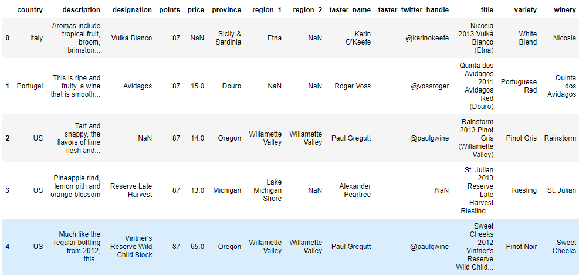
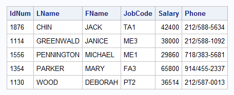

# Using SQL with Pandas

## Introduction

It turns out that you can write SQL to retrieve and mutate information within a DataFrame. We wanted to make sure to provide you with at least a brief introduction to the topic on your last day of the course!

## Objectives
You will be able to:
- Use the basic syntax for querying pandas DataFrames with SQL statements

## Pandas and SQL

Consider the structure of a **_Pandas DataFrame_**.  




Now, let's consider the structure of a table from a **_SQL database_**.




You've probably noticed by now that they're essentially the same--a table of values, with each row having a unique index and each column having a unique name.  Even better, the Pandas team has implemented the ability to retrieve information from a DatFrame using SQL, allowing you to leverage SQL for working with data in a DataFrame.

## Using `.query()`

Pandas DataFrames come with a built-in query method, which allows you to get information from DataFrames quickly without using the cumbersome slicing syntax.  

See the following examples:

```python
# Getting Data using slicing syntax
foo_df = bar_df[bar_df[bar_df['Col_1'] > bar_df['Col_2']]]

# Using The query method
foo_df = bar_df.query("Col_1 > Col_2")

# These two lines are equivalent!
```

Note that if you want to use `AND` and `OR` statements with the `.query()` method, you'll need to use `"&"` and `"|"` instead.

```python
foo_df = bar_df.query("Col_1 > Col_2 & Col_2 <= Col_3")

```

## Summary

These advanced methods for querying DataFrames can make your life a lot easier by simplifying the syntax and allowing us to make use of SQL. Use them to save yourself time and give keep your SQL skills strong!
